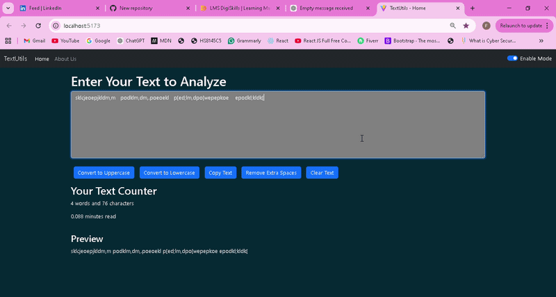

# TextUtils
TextUtils is a simple and efficient **React-based text utility application** that allows users to quickly manipulate and analyze text.

The app provides useful features such as converting text case, clearing text, copying content, removing extra spaces, and viewing text statistics in real time.

This project was built to practice **React fundamentals, component-based architecture, and state management**.

---

## Features

- Convert text to **Uppercase**
- Convert text to **Lowercase**
- **Clear text** instantly
- **Copy text** to clipboard
- **Remove extra spaces**
- **Real-time text summary**
- **Word and character counter**
- **Estimated reading time**
- Clean and responsive interface

---

## Tech Stack

- **React**
- **Vite**
- **JavaScript (ES6)**
- **HTML5**
- **CSS3**

---

## Demo




---
---

## Installation

Clone the repository

```bash
git clone https://github.com/Faiza-Umar/TextUtils
```

Navigate into the project folder

```bash
cd TextUtils
```

Install dependencies

```bash
npm install
```

Run the development server

```bash
npm run dev
```

The application will start on:

```
http://localhost:5173
```

---

## What I Learned

While building this project I practiced:

- React component structure
- Managing **state with useState**
- Handling **user input and events**
- Creating reusable UI components
- Organizing project structure using **Vite**

---

## Future Improvement
- More text formatting tools
- Option to download edited text
- Improved UI design

---

## Author

**Faiza Umar**

Frontend Developer

GitHub  
https://github.com/Faiza-Umar

LinkedIn  
https://www.linkedin.com/in/frontend-spark/


---

## ⭐ Support

If you like this project, consider **starring the repository**.
